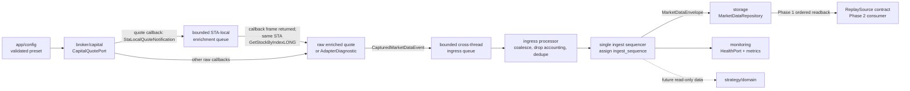

# Phase 1 行情接收、標準化、紀錄與讀回架構設計契約

狀態：Proposed  
適用範圍：Phase 1  
時區：`Asia/Taipei`  
安全邊界：**接收、標準化、紀錄與完整讀回行情，產出 Phase 2 可回放的排序資料；絕不建立 Order/Reply COM object，絕不送出真實委託。**

## 1. 目的、範圍與 non-goals

Phase 1 建立一條可測試、可持久化、可完整讀回且預設不連線券商的行情資料管線，供 Phase 2 回放與後續策略研究使用。包含：

- 從 `offline` fixture 或明確 opt-in 的 Capital/SKCOM `live` quote source 接收行情。
- 將連線狀態、伺服器時間、商品資料、quote 與 tick 轉為穩定的 domain model。
- 以 SQLite 紀錄 instrument、quote、tick、connection event 與 recording session。
- 依 session-global `ingest_sequence` 完整讀回所有已錄事件，驗證 round-trip integrity，並定義 `ReplaySource` 讀取契約。
- 提供 health snapshot 與可觀測性 metrics。

Phase 1 明確排除：

- `SKOrderLib`、`SKReplyLib`、Order/Reply callback、帳務、部位、委託及成交回報。
- paper/live execution engine；`execution_mode` 僅作安全驗證，不能驅動下單。
- 實際 replay runtime、依事件時間等待、speed/pause/resume 控制；這些屬於 Phase 2。
- `PaperBroker` 與任何 paper execution；這些屬於 Phase 2 或後續階段。
- 策略訊號、風控、損益與任何自動交易。
- 多券商抽象的完整實作、分散式 message broker、遠端資料庫及 GUI。

任何 Phase 1 process 收到 `execution_mode=live` 都必須在建立 COM object 前拒絕啟動。

## 2. 已驗證的 repository 基線與約束

以下只陳述本文件撰寫時可由 repository 驗證的事實：

| 證據 | 已驗證事實 | Phase 1 約束 |
|---|---|---|
| `quote_client.py:28-46`, `QuoteClient.__init__` | 有 `quote_only` flag，且 client 同時持有 quote、order、reply 狀態欄位。 | 保留 façade，但新 live adapter 固定 quote-only；Order/Reply 不屬於其依賴。 |
| `quote_client.py:64-97`, `QuoteClient._try_load_api` | 載入成功時建立 Center/Quote；只有 `quote_only=False` 才建立 Order/Reply。 | 新 app preset 不可依賴呼叫者記得傳 boolean；由 mode validation 強制安全組合。 |
| `quote_client.py:99-109`, `QuoteClient.initialize` | API 載入失敗後設 `_offline_mode=True`、`_connected=True` 並回傳 `True`。 | 現況是 offline fail-open；新 `live` source 必須 fail-closed，不得自動降級。 |
| `quote_client.py:152-198`, `QuoteClient.login` | `login` 先在 `quote_client.py:154-155` 驗證 account/password 非空，之後 offline 分支才於 `quote_client.py:156-157` 回傳成功；quote-only login 會略過 Reply callback。 | 「新 composition 的 offline 不讀帳密」是目標行為，與舊 façade 有意不同；live 的每一步錯誤都向上傳遞。 |
| `quote_client.py:200-295`, `QuoteClient._register_quote_callback` | callback 寫入 dict；`quotes`、`ticks` 是 list 且以 `append` 累積。 | 這些 list 無容量限制；新 adapter callback 只能 nonblocking enqueue 到有界 buffer。 |
| `quote_client.py:244-280`, `OnNotifyTicks` / `OnNotifyTicksLONG` | callback 保留 `nPtr`、日期、時間、bid/ask/close、qty、simulate；LONG 另標記 `long=True`。 | raw 欄位先無損保留；未確認語意的欄位不得臆測轉換。 |
| `quote_client.py:361-442`, `enter_monitor` / `leave_monitor` | monitor 有 best-effort、可重試 cleanup 與 subscription set。 | 狀態機保留 idempotent stop/cleanup，且由同一 STA thread 執行。 |
| `quote_client.py:444-491`, `_pump_com_messages` / `wait_for_quote_ready` | 現況由呼叫執行緒執行 `PumpWaitingMessages()` 並輪詢 ready。 | COM message pump、COM object 與 SDK call 必須集中到 dedicated STA thread。 |
| `quote_client.py:493-576`, request/get methods | offline 回傳既有 dict；live request 回傳 `success/code/message` 等 keys；event snapshot 含 `server_time/stock_list/quotes/ticks`。 | façade 遷移期間維持既有 keys，domain contract 不直接暴露 COM object。 |
| `main.py:12-32`, `main` | 使用預設 `QuoteClient()`，登入後呼叫 `order_initialize`、`order_load_commodity_gw`、`connect_reply_by_id`。 | 此 entry point 對 Phase 1 不安全；Phase 1 不執行、不沿用，改用安全 app entry point。 |
| `config.py:9-12,34-39` | config import 時建立 log directory，帳密由環境變數取得，symbols 有預設值。 | 新純 config/domain import 不產生 filesystem side effect；secret 僅在 live adapter 邊界解析。 |
| `tests/integration/test_skcom_quote_live.py:25-79` | 測試驗證 quote-only 只建立 Center/Quote，並阻止 Reply callback。 | 此 guard test 必須保留並擴充到 app composition。 |
| `tests/integration/test_skcom_quote_live.py:125-151` | live fixture 需 Windows、環境變數 opt-in、DLL 與帳密，且 monkeypatch Order/Reply 方法。 | 所有 live 測試維持 explicit opt-in；CI/default test 不登入。 |
| `tests/integration/test_skcom_quote_live.py:154-196` | live 測試驗證登入、ready、商品、quote/tick subscription；不要求市場休市時收到 tick。 | live smoke test 不作 deterministic 資料量斷言。 |

`tests/test_quote_client.py:9-23` 的既有 unit tests 會直接呼叫 `QuoteClient()`，其中 login test 傳入非空 `"demo"` credentials，之後依賴目前 offline 成功行為。相容期不能直接把 façade 的預設行為改成例外；安全的新 app composition（offline 不讀帳密）與舊 façade（仍先驗證非空帳密）必須先分開，以 contract test 明示差異，再逐步收斂。

## 3. 模式模型與安全 preset

兩個維度必須分離，不能用單一 `mode` 混合資料來源與執行權限：

```python
QuoteSource = Literal["offline", "replay", "live"]
ExecutionMode = Literal["disabled", "paper", "live"]
```

| Preset | `quote_source` | `execution_mode` | Phase 1 結果 |
|---|---|---|---|
| `phase1_default` | `offline` | `disabled` | 預設；產生明確的 offline health，不載入 COM，不讀帳密。 |
| `phase2_replay`（保留） | `replay` | `disabled` | Phase 2 runtime preset；Phase 1 config 可辨識但必須拒絕啟動實際回放。 |
| `phase1_live_quote` | `live` | `disabled` | 僅在 explicit opt-in 後允許；只建 Center/Quote。 |
| `research_paper`（保留） | `replay` 或 `offline` | `paper` | Phase 2 或後續 preset；Phase 1 必須拒絕。 |
| `live_trade` | 任意 | `live` | **fail-closed：Phase 1 啟動時立即拒絕。** |
| 非法組合 | `live` | `paper` | Phase 1 拒絕，避免「行情 process」被誤當交易 process。 |

設定驗證順序：

1. parse enum，不接受未知值或拼字修正；
2. 驗證 Phase 1 永遠 `execution_mode=disabled`；
3. `quote_source=live` 要求獨立 opt-in（建議 `TX_TRADE_ENABLE_LIVE_QUOTE=1`）；
4. `quote_source=replay` 與 `execution_mode=paper` 在 Phase 1 僅保留 enum/contract，runtime 啟動必須拒絕；
5. 完成上述驗證後才可解析 DLL path 與 credentials；offline 不解析、不要求帳密；
6. live 初始化、登入、monitor、ready、subscription 任一步失敗皆回報 failed health、清理資源並退出，**不得 fallback 到 offline/replay**。

## 4. 目標模組樹與單一責任

建議逐步形成下列 package；路徑是設計目標，非本文件宣稱已存在：

```text
tx_trade/
├── app/
│   ├── phase1.py                 # composition root；建立 mode 對應元件與 lifecycle
│   └── config.py                 # 純設定解析、preset 與 fail-closed validation
├── broker/
│   └── capital/
│       ├── quote_adapter.py      # CapitalQuotePort adapter；不含 Order/Reply
│       ├── com_runtime.py        # dedicated STA thread、command queue、pump、cleanup
│       └── event_mapper.py       # SKCOM callback raw payload -> CapturedMarketDataEvent
├── market_data/
│   ├── models.py                 # 本文件定義的 immutable domain contracts
│   ├── ports.py                  # CapitalQuotePort、sink、clock、ReplaySource 讀取契約
│   ├── pipeline.py               # validation、ordering、dedupe、fan-out
│   └── readback.py               # Phase 1 完整讀回與 round-trip integrity
├── storage/
│   ├── sqlite_repository.py      # repository query 與 transaction boundary
│   ├── sqlite_writer.py          # 有界 writer queue、batch/WAL
│   └── schema.sql                # Phase 1 schema（migration 由 Commander 管理）
├── monitoring/
│   ├── health.py                 # health state aggregation
│   └── metrics.py                # counters/gauges/histograms
└── quote_client.py               # 舊介面 façade，轉接新 pipeline（遷移期間）
```

責任邊界：

- `broker/capital` 是唯一可以 import `pythoncom`、`comtypes` 或 `comtypes.gen.SKCOMLib` 的 production package。
- `market_data` 只認識 Python/stdlib 型別、`Decimal` 與 ports；不得 import broker。
- `storage` 實作 repository，不認識 SKCOM callback。
- `monitoring` 消費標準 health/metric event，不控制 COM。
- `app/config` 是唯一 composition root；config model 本身不可在 import 時建目錄、登入或建立 COM。
- 未來 `strategy` / `domain` 只能依賴 `market_data.models` 與 ports，**不得 import `comtypes`、`SKCOMLib` 或 `broker.capital`**。

## 5. 依賴方向與資料流



依賴方向為外層 adapter 實作內層 port：`app -> broker/storage/readback -> market_data ports/models`。`market_data` 不反向 import adapter；strategy/domain 不接觸 COM 或 SQLite row。

Live 資料流：

1. quote callback 只擷取 market/index/LONG flag、callback sequence 與 `received_at`，建立 `StaLocalQuoteNotification`，nonblocking 投遞到 bounded STA-local enrichment queue；callback frame 內禁止 `GetStockByIndexLONG`。
2. callback 返回後，COM STA runner 在同一 STA thread 的 pump/command loop drain enrichment queue，才呼叫 `GetStockByIndexLONG`。成功後 mapper 建立完整 raw quote capture；失敗則建立 `AdapterDiagnostic`，原 notification 不得遺失。
3. 其他 callback 同樣只建立 raw captured payload。adapter 將已可跨 thread 的 `CapturedMarketDataEvent` nonblocking 送入另一個 bounded ingress queue。
4. ingress processor 在 captured 型別上完成 quote coalesce、tick drop accounting、validation、metadata normalization 與 dedupe。
5. 事件成功被 persistence pipeline 接受後，唯一 ingest sequencer 才配置 session-global `ingest_sequence` 並建立 `MarketDataEnvelope`。
6. repository 只接受 envelope，writer 以 batch transaction 寫 SQLite；health/metrics 同步更新。
7. consumer 只收到已有 persistence ordering 的 `MarketDataEnvelope`。

Phase 1 readback 只依 `ingest_sequence` 還原錄製順序並驗證每種 event type 的 round-trip；不根據 `event_at` 等待或控制播放速度。Phase 2 replay runtime 才消費 `ReplaySource`，其 timing policy 不屬於本文件的 Phase 1 DoD。

## 6. 共通資料規則

- Domain model 建議使用 `@dataclass(frozen=True, slots=True)`；序列化時 enum 使用穩定字串。
- `schema_version` 初始為正整數 `1`；reader 遇到未知 major/schema version 必須拒絕，不可猜測。
- 所有 datetime 均為 timezone-aware `datetime`，timezone 固定 `ZoneInfo("Asia/Taipei")`。SQLite 以包含 UTC offset 的 ISO 8601 TEXT 保存；禁止 naive datetime。
- `received_at` 是本系統接到 callback/row 的時間；`event_at` 是交易所/伺服器事件時間。若來源沒有 event time，欄位為 `None`，不得用 `received_at` 冒充。
- `trading_day` 是交易日 `date`，不保證等於 calendar day；應由已確認的 market calendar/session metadata 決定。資料不足時為 `None` 並標示 degraded。
- 所有價格同時保存券商的 `*_raw: int` 與 `*_normalized: Decimal`。計算式為 `Decimal(raw) * instrument.price_scale`。
- `price_scale` 來自 instrument metadata，禁止硬編碼 `/100`。scale 未知時 raw 必須保留、normalized 為 `None`、health degraded。
- `source_mode` 只可為 `offline|replay|live`。
- `connection_generation` 是每次成功建立新 live connection 的單調遞增整數；重連後不可沿用。offline fixture 固定為 `0`。
- `sequence` 是 generation 內由 ingress adapter 指派的 callback 觀察序號，重連後可從 `0` 重啟；它不是 replay cursor，也不宣稱是交易所序號。
- `broker_sequence` 是券商明確提供的 sequence，沒有 authoritative 欄位時必須為 `None`；tick 的 `nPtr` 另存於 `source_pointer_raw`，兩者都不可冒充 `ingest_sequence`。
- `ingest_sequence` 是 recording session 內、跨 reconnect generation 仍嚴格單調遞增且不重設的整數，由單一 ingest sequencer 在事件進入持久化管線時指派。它是 authoritative persistence ordering、pagination 與 Phase 2 replay cursor。
- dedupe key 必須依 registered event type 使用 canonical recipe，不可只套用一個含糊公式。一般行情事件的基礎 recipe 為 `"{source}:{session_id}:{generation}:{event_type}:{market_no}:{stock_idx}:{source_pointer_or_sequence}"`；若已確認 `nPtr` 在特定 generation/instrument 唯一，tick 使用 `nPtr`，否則加上 raw event time/price/qty hash。`adapter_diagnostic` 必須至少包含 `diagnostic_kind + callback_sequence + attempt`，確保同一 notification 的每次 retry 都能獨立稽核。不能在 ADR 未決前假設跨重連唯一。

## 7. Domain 資料契約

「必填」指建立該 model 時必須提供；`Optional[T]` 欄位仍可明確提供 `None`。

唯一 authoritative lifecycle enum 如下；domain model、狀態機、health 與 DB CHECK 必須共用同一組值。`broker_kind_raw` 是外部 `nKind`，不得直接當 lifecycle state：

```python
class ConnectionState(StrEnum):
    NEW = "new"
    STARTING = "starting"
    COM_READY = "com_ready"
    LOGGING_IN = "logging_in"
    LOGGED_IN = "logged_in"
    ENTERING_MONITOR = "entering_monitor"
    CONNECTED = "connected"
    STOCKS_READY = "stocks_ready"
    SUBSCRIBED = "subscribed"
    DISCONNECTED = "disconnected"
    RECONNECTING = "reconnecting"
    STOPPING = "stopping"
    ERROR = "error"
    STOPPED = "stopped"
```

### 7.1 `ConnectionStatus`

| 欄位 | 型別 | 必填 | 語意／單位 |
|---|---|---:|---|
| `state` | `ConnectionState` | 是 | 上述唯一 lifecycle enum；不可填 broker `nKind`。 |
| `broker_kind_raw` | `int \| None` | 是 | SKCOM `OnConnection.nKind` 原值；非 live 可為 `None`。 |
| `broker_code_raw` | `int \| None` | 是 | SKCOM `OnConnection.nCode` 原值。 |
| `message` | `str \| None` | 是 | 已去除敏感資訊的診斷訊息。 |
| `is_ready` | `bool` | 是 | 是否已可接受 quote subscription/read。 |
| `changed_at` | aware `datetime` | 是 | 本系統觀察到狀態改變時間。 |
| `connection_generation` | `int` | 是 | 此連線世代，`>=0`。 |

### 7.2 `ServerTime`

| 欄位 | 型別 | 必填 | 語意／單位 |
|---|---|---:|---|
| `event_at` | aware `datetime \| None` | 是 | 由已驗證的 server date/time 組成；僅有時分秒而日期不確定時為 `None`。 |
| `hour_raw` | `int` | 是 | callback hour 原值。 |
| `minute_raw` | `int` | 是 | callback minute 原值。 |
| `second_raw` | `int` | 是 | callback second 原值。 |
| `total_raw` | `int` | 是 | callback `nTotal` 原值；語意待 ADR 確認，不先轉單位。 |
| `received_at` | aware `datetime` | 是 | callback 進入系統時間。 |
| `trading_day` | `date \| None` | 是 | 已解析交易日。 |

### 7.3 `Instrument`

| 欄位 | 型別 | 必填 | 語意／單位 |
|---|---|---:|---|
| `instrument_id` | `str` | 是 | 系統穩定 ID，建議 `{venue}:{market_no}:{symbol}`。 |
| `symbol` | `str` | 是 | 券商商品代碼，例如 `TX00`；保留大小寫。 |
| `venue` | `str` | 是 | 交易場所穩定代碼；未知時用明確 `UNKNOWN`，不可空字串。 |
| `market_no` | `int \| None` | 是 | SKCOM market number 原值。 |
| `stock_idx` | `int \| None` | 是 | SKCOM stock index 原值；可隨 metadata/session 更新。 |
| `display_name` | `str \| None` | 是 | 人類可讀名稱。 |
| `asset_class` | `str \| None` | 是 | 例如 future；只有確認後才填。 |
| `currency` | `str \| None` | 是 | ISO 4217 code；未知為 `None`。 |
| `price_scale` | `Decimal \| None` | 是 | raw integer 乘數，例如 metadata 確認後的 `Decimal("0.01")`；未知為 `None`。 |
| `quantity_scale` | `Decimal \| None` | 是 | raw qty 乘數；metadata 未確認時為 `None`，不得猜測為 `1`。 |
| `metadata_version` | `int` | 是 | metadata revision，從 `1` 開始。 |
| `updated_at` | aware `datetime` | 是 | 本系統取得或更新此 metadata 的 authoritative event time。 |
| `raw_payload` | `Mapping[str, JSONScalar] \| None` | 是 | 可稽核的已白名單 raw metadata；不得放 COM object。 |

### 7.4 `Quote`

Quote 是某商品在一個時間點可取得的完整 snapshot。quote callback frame 只建立 `StaLocalQuoteNotification`，不得呼叫 lookup 或建立 Quote；callback 返回後，由 COM STA runner 在同一 STA thread drain enrichment queue 並成功執行 `GetStockByIndexLONG`，mapper 才能建立 Quote。raw price 仍全部必填，不可用 nullable 偽裝 enrichment 成功。

| 欄位 | 型別 | 必填 | 語意／單位 |
|---|---|---:|---|
| `instrument_id` | `str` | 是 | 對應 `Instrument.instrument_id`。 |
| `market_no_raw` | `int` | 是 | callback market number。 |
| `stock_idx_raw` | `int` | 是 | callback stock index。 |
| `bid_raw` / `ask_raw` / `last_raw` | `int` | 是 | 券商 raw integer price；建立 Quote event 前必須完整取得，缺值時不得建造不完整 Quote。 |
| `bid_normalized` / `ask_normalized` / `last_normalized` | `Decimal \| None` | 是 | 依當時 instrument metadata scale 換算。 |
| `bid_qty_raw` / `ask_qty_raw` / `last_qty_raw` | `int \| None` | 是 | 券商 raw quantity。 |
| `event_at` | aware `datetime \| None` | 是 | quote 事件時間；來源未提供時為 `None`。 |
| `received_at` | aware `datetime` | 是 | callback 接收時間。 |
| `trading_day` | `date \| None` | 是 | 交易日。 |
| `is_simulated` | `bool \| None` | 是 | 券商明確提供才設值。 |
| `is_long_callback` | `bool` | 是 | 是否來自 LONG callback。 |

### 7.5 `Tick`

| 欄位 | 型別 | 必填 | 語意／單位 |
|---|---|---:|---|
| `instrument_id` | `str` | 是 | 對應商品。 |
| `market_no_raw` | `int` | 是 | `sMarketNo` 原值。 |
| `stock_idx_raw` | `int` | 是 | `sStockIdx/nStockIdx` 原值。 |
| `source_pointer_raw` | `int` | 是 | `nPtr` 原值；唯一性尚未假設。 |
| `date_raw` | `int` | 是 | `nDate` 原值。 |
| `time_hms_raw` | `int` | 是 | `nTimehms` 原值。 |
| `time_subsecond_raw` | `int` | 是 | `nTimemillismicros` 原值；單位待 ADR 確認。 |
| `bid_raw` / `ask_raw` / `close_raw` | `int` | 是 | 券商 raw integer prices。 |
| `bid_normalized` / `ask_normalized` / `close_normalized` | `Decimal \| None` | 是 | `raw * price_scale`；scale 未知則 `None`。 |
| `quantity_raw` | `int` | 是 | `nQty` 原值。 |
| `quantity_normalized` | `Decimal \| None` | 是 | 已確認 `quantity_scale` 時為 `quantity_raw * quantity_scale`；未知時為 `None`。 |
| `simulate_raw` | `int` | 是 | `nSimulate` 原值。 |
| `is_simulated` | `bool \| None` | 是 | 只有 mapping 經確認才轉換；未知 `nSimulate` 仍保存整筆 raw event、此欄為 `None` 並將 health 設為 degraded。 |
| `event_at` | aware `datetime \| None` | 是 | 由 raw date/time 按已確認規則解析。 |
| `received_at` | aware `datetime` | 是 | callback 接收時間。 |
| `trading_day` | `date \| None` | 是 | 交易日。 |
| `is_long_callback` | `bool` | 是 | `OnNotifyTicksLONG` 為 `True`。 |

### 7.6 `AdapterDiagnostic`

Adapter enrichment/parse 失敗也是必須持久化的 domain event，不得只寫 log：

| 欄位 | 型別 | 必填 | 語意／單位 |
|---|---|---:|---|
| `diagnostic_kind` | `Literal["quote_lookup_failure","stock_list_parse_failure","adapter_error"]` | 是 | 穩定錯誤分類。 |
| `market_no_raw` | `int \| None` | 是 | 原 notification market number。 |
| `stock_idx_raw` | `int \| None` | 是 | 原 notification stock index。 |
| `error_code_raw` | `int \| None` | 是 | SDK/adapter error code。 |
| `message` | `str` | 是 | 已 redacted、長度有界的錯誤訊息。 |
| `received_at` | aware `datetime` | 是 | 原 notification capture time。 |
| `attempt` | `int` | 是 | 本 notification enrichment attempt，從 `1` 開始。 |
| `connection_generation` | `int` | 是 | 發生錯誤的 generation。 |
| `callback_sequence` | `int` | 是 | 原 callback observation sequence。 |
| `raw_notification` | `Mapping[str, JSONValue]` | 是 | 可重建診斷的完整白名單 raw notification。 |

`quote_lookup_failure` 立即令 health degraded、recording session incomplete，並經 ingress/sequencer 成為 `event_type="adapter_diagnostic"` 的 envelope 寫入 authoritative `event_log`。可設定有限次數、有限 backoff 的 retry；每次 attempt 都可稽核，超限後不可丟棄原 notification。

### 7.7 Raw captured payload 與 `CapturedMarketDataEvent`

這是 callback/adapter 到 bounded ingress queue 的唯一型別，建議為 immutable dataclass。它代表「已捕捉但尚未被持久化管線接受」的事件，**絕不包含 `ingest_sequence`，callback 也絕不建立 `MarketDataEnvelope`**。

STA-local quote notification 與 cross-thread ingress payload 是兩個互斥型別；型別契約本身必須阻止未 enrichment notification 被送進 `IngressSink`：

```python
@dataclass(frozen=True, slots=True)
class StaLocalQuoteNotification:
    market_no_raw: int
    stock_idx_raw: int
    is_long_callback: bool
    callback_sequence: int
    received_at: datetime

IngressCapturedPayload = (
    CapturedQuoteSnapshot
    | CapturedTickNotification
    | CapturedConnectionNotification
    | CapturedServerTimeNotification
    | CapturedStockListNotification
    | CapturedAdapterDiagnostic
)
```

- `StaLocalQuoteNotification`：只允許進 STA-local enrichment queue；它不是 `CapturedMarketDataEvent`，也不屬於 `IngressCapturedPayload`。
- `CapturedQuoteSnapshot`：enrichment 成功後的 market/index、完整 raw bid/ask/last 與 raw qty/time/LONG flag；才允許進 cross-thread ingress。
- `CapturedTickNotification`：callback 的 market/index/nPtr/date/time/bid/ask/close/qty/simulate/LONG flag 原值。
- `CapturedConnectionNotification`：`nKind/nCode`、callback sequence、received time 原值。
- `CapturedServerTimeNotification`：hour/minute/second/total 與 received time 原值。
- `CapturedStockListNotification`：market number、完整白名單 stock-list text/bytes representation、received time；大小上限與 overflow 要 metric。
- `CapturedAdapterDiagnostic`：由 `AdapterDiagnostic` 欄位形成的 raw-preserving capture，保留 lookup/parse failure provenance。

| 欄位 | 型別 | 必填 | 語意／單位 |
|---|---|---:|---|
| `captured_kind` | `Literal["quote_snapshot","tick_notification","connection_notification","server_time_notification","stock_list_notification","adapter_diagnostic"]` | 是 | cross-thread raw payload discriminator；不含 local-only quote notification，也不是 envelope event type。 |
| `payload` | `IngressCapturedPayload` | 是 | 上述 cross-thread raw captured union；不得放 `StaLocalQuoteNotification` 或完整 domain model union。 |
| `raw_payload` | `Mapping[str, JSONValue] \| None` | 是 | callback/source 白名單 raw values；不得含 COM object/secret。 |
| `source` | `str` | 是 | adapter/fixture ID。 |
| `source_mode` | `Literal["offline","live"]` | 是 | Phase 1 capture source。 |
| `session_id` | `UUID` | 是 | 目標 recording session。 |
| `connection_generation` | `int` | 是 | capture 時的 live generation；offline 為 `0`。 |
| `sequence` | `int` | 是 | generation 內 callback 觀察序號。 |
| `broker_sequence` | `int \| None` | 是 | 券商明確提供才填。 |
| `received_at` | aware `datetime` | 是 | callback/fixture capture time，永遠 required。 |
| `event_at` | aware `datetime \| None` | 是 | authoritative value 已知才填。 |
| `trading_day` | `date \| None` | 是 | authoritative value 已知才填。 |
| `metadata_version` | `int \| None` | 是 | 已知的 instrument metadata revision。 |
| `dedupe_candidate` | `str \| None` | 是 | adapter 可提出候選值；ingress processor 驗證/完成後才成 envelope `dedupe_key`。 |

處理邊界：

- quote callback 只 nonblocking 寫 bounded STA-local queue；該 queue 只接受 `StaLocalQuoteNotification`，不得呼叫 `IngressSink`、lookup 或配置/預留 `ingest_sequence`。
- STA runner 在 callback frame 返回後 drain local queue；lookup 成功轉成 `CapturedQuoteSnapshot`，失敗轉成 `CapturedAdapterDiagnostic`。兩者才可送 `IngressSink.try_publish(captured)`。
- 其他完整 raw notification 可由 callback nonblocking 送 cross-thread ingress；兩個 queue 是不同資源、各自有 capacity/overflow metric。
- quote latest coalesce、tick overflow/drop accounting 及 dedupe 都以 captured event 的 `sequence`、generation、raw values/dedupe candidate 處理。
- 被 coalesce、drop 或判定 duplicate 的 captured event 沒有 `ingest_sequence`，也不建立 envelope。
- 成功通過 validation/dedupe 且被 persistence pipeline 接受後，單一 ingest sequencer 原子取得下一個 session-global `ingest_sequence`，建立 immutable `MarketDataEnvelope`，再交給 repository。
- sequencer 配置失敗時不得把 captured event 宣稱為 persisted；health failed/degraded 並將 session 標為 incomplete。

### 7.8 `MarketDataEnvelope`

Envelope 自有並 authoritative 管理 persistence/routing metadata；不得假設 metadata 一定能從 payload 推導。payload 可以為 domain 使用方便而重複時間欄位，但寫入、排序、pagination、routing 一律採 envelope 值，validator 只檢查有重複值時兩者一致。

| 欄位 | 型別 | 必填 | 語意／單位 |
|---|---|---:|---|
| `schema_version` | `int` | 是 | domain serialization schema；初始 `1`。 |
| `event_type` | `Literal["connection_status","server_time","instrument","quote","tick","adapter_diagnostic"]` | 是 | registered payload discriminator。 |
| `payload` | `ConnectionStatus \| ServerTime \| Instrument \| Quote \| Tick \| AdapterDiagnostic` | 是 | 必須與 `event_type` 一致。 |
| `source` | `str` | 是 | adapter ID，例如 `capital_skcom` 或 offline fixture ID。 |
| `source_mode` | `Literal["offline","replay","live"]` | 是 | 資料來源模式。 |
| `session_id` | `UUID` | 是 | recording session ID；Phase 2 replay 沿用原錄製 ID 或另以 provenance 欄位關聯。 |
| `ingest_sequence` | `int` | 是 | session-global、跨 generation 不重設的 authoritative ordering/pagination cursor。 |
| `connection_generation` | `int` | 是 | generation 內排序/dedupe 維度。 |
| `sequence` | `int` | 是 | generation 內 callback 觀察序號；只作診斷/dedupe input。 |
| `broker_sequence` | `int \| None` | 是 | 券商明確提供的序號；未提供不得合成。 |
| `dedupe_key` | `str` | 是 | session 內唯一的穩定 dedupe key。 |
| `event_at` | aware `datetime \| None` | 是 | authoritative event time；無可靠來源時明確為 `None`，不作 persistence ordering。 |
| `received_at` | aware `datetime` | 是 | authoritative ingress 接收時間，永遠 required。 |
| `trading_day` | `date \| None` | 是 | authoritative 交易日；無可靠值時為 `None`。 |
| `metadata_version` | `int \| None` | 是 | 價格/數量換算採用的 Instrument metadata version。 |
| `raw_payload` | `Mapping[str, JSONValue] \| None` | 是 | callback/source 的白名單 raw values；供無損稽核，不含 COM object/secret。 |

Event-type metadata mapping：

| `event_type` | Envelope `event_at` | Envelope `trading_day` | payload 重複欄位規則 |
|---|---|---|---|
| `connection_status` | 必須等於 `payload.changed_at` | 通常 `None`；只有 authoritative session calendar 才可填 | `changed_at` 與 envelope 一致；payload 不主導 persistence。 |
| `server_time` | 可為 `payload.event_at`；日期/時間語意未確認時 `None` | 可為 `payload.trading_day`；未知時 `None` | `received_at/event_at/trading_day` 若非 null 必須與 envelope 一致。 |
| `instrument` | 必須等於 `payload.updated_at` | 通常 `None`，除非 metadata 明確按交易日生效 | `updated_at` 與 envelope 一致。 |
| `quote` | 等於 `payload.event_at`，可 `None` | 等於 `payload.trading_day`，可 `None` | `received_at/event_at/trading_day` 與 envelope 一致。 |
| `tick` | 等於 `payload.event_at`，可 `None` | 等於 `payload.trading_day`，可 `None` | `received_at/event_at/trading_day` 與 envelope 一致。 |
| `adapter_diagnostic` | `None`（除非 error source 有另行驗證的 event time） | `None` | envelope `received_at` 等於 diagnostic 原 notification `received_at`；generation/sequence 必須一致。 |

Envelope validation 必須檢查 timezone、enum、non-negative generation/sequence/ingest sequence、payload discriminator、event-type mapping、raw/normalized 一致性及 dedupe key 非空。`ingest_sequence` 在 session 內嚴格遞增；禁止用 binary float 表示價格。

## 8. Port / protocol contracts

以下 skeleton 是設計契約，不要求精確照抄檔案配置：

```python
from collections.abc import Iterable, Iterator, Sequence
from datetime import datetime
from typing import Protocol

class CapitalQuotePort(Protocol):
    def start(self) -> None: ...
    def login(self, account: str, password: str) -> None: ...
    def enter_monitor(self) -> None: ...
    def wait_until_ready(self, timeout_seconds: float) -> ConnectionStatus: ...
    def subscribe_quotes(self, symbols: Sequence[str]) -> None: ...
    def subscribe_ticks(self, symbols: Sequence[str]) -> None: ...
    def unsubscribe_quotes(self, symbols: Sequence[str]) -> None: ...
    def unsubscribe_ticks(self, symbols: Sequence[str]) -> None: ...
    def stop(self, timeout_seconds: float) -> None: ...

class IngressSink(Protocol):
    def try_publish(self, event: CapturedMarketDataEvent) -> IngressDecision: ...

class MarketDataSink(Protocol):
    def publish(self, envelope: MarketDataEnvelope) -> None: ...  # post-sequencer only

class MarketDataRepository(Protocol):
    def begin_session(self, session: RecordingSession) -> None: ...
    def append_batch(self, events: Sequence[MarketDataEnvelope]) -> None: ...
    def end_session(self, session_id: str, ended_at: datetime, status: str) -> None: ...
    def iter_events(
        self,
        session_id: str,
        *,
        after_ingest_sequence: int | None = None,
        event_types: set[str] | None = None,
    ) -> Iterator[MarketDataEnvelope]: ...

class Clock(Protocol):
    def now(self) -> datetime: ...          # aware Asia/Taipei
    def monotonic(self) -> float: ...

class HealthPort(Protocol):
    def record_status(self, status: ConnectionStatus) -> None: ...
    def degrade(self, reason: str, *, details: dict[str, object] | None = None) -> None: ...
    def snapshot(self) -> HealthSnapshot: ...

class ReplaySource(Protocol):
    def open(self, session_id: str) -> None: ...
    def iter_events(
        self, *, after_ingest_sequence: int | None = None
    ) -> Iterator[MarketDataEnvelope]: ...
    def verify_integrity(self) -> ReadbackIntegrityReport: ...
```

規則：

- Port 以 exception 表示啟動/命令失敗，不回傳模糊的 success dict；相容 dict 由 façade 轉換。
- `stop()` 必須 idempotent；partial start 後也能呼叫。
- quote callback 只能 nonblocking 寫 STA-local notification queue；其他 raw callback 才可呼叫 nonblocking `IngressSink.try_publish(CapturedMarketDataEvent)`。`IngressDecision` 明確回報 accepted/coalesced/dropped/duplicate；callback 不得呼叫 quote lookup、envelope sink 或 repository。
- `MarketDataSink.publish()` 僅供 sequencer 後的 envelope consumer，不是 callback ingress。
- `append_batch()` 必須接受並持久化全部 registered envelope event types（目前包含 adapter diagnostic），不能只寫 typed quote/tick table。
- repository 與 `ReplaySource.iter_events()` 均以 `after_ingest_sequence` 作 exclusive cursor，固定 `ORDER BY ingest_sequence ASC`；nullable `event_at` 不得作 authoritative ordering/pagination。
- `ReplaySource` 在 Phase 1 只代表 replay-ready readback contract；實際 timing/speed/pause runtime 在 Phase 2。

## 9. 有界 queue、backpressure 與 overflow

所有 queue 容量由 config 明確設定並在啟動時記錄，例如：

- `ingress_connection_capacity`
- `ingress_quote_capacity`
- `ingress_tick_capacity`
- `sta_quote_enrichment_capacity`
- `storage_writer_capacity`
- `storage_batch_size`
- `storage_flush_interval_ms`

不能使用無界 list/queue。STA-local quote enrichment queue 與 cross-thread ingress queue 都必須有界、nonblocking，且分別暴露 depth/capacity/overflow metrics。bounded ingress queue 只承載已可跨 thread 的 `CapturedMarketDataEvent`，絕不承載未 enrichment 的 quote notification或 callback 建立的 envelope。callback 只做 capture、callback sequence、最低限度 raw mapping 與 nonblocking enqueue；不可配置 `ingest_sequence`、不可執行 `GetStockByIndexLONG`、不可 log 大 payload、不可查 DB、不可等待 disk、不可 sleep。

Overflow policy：

1. connection/server-time/health events 使用獨立高優先 queue 或 reserved slots；不得被 quote/tick 排擠。若仍滿載，進入 fatal/degraded（依事件等級）並記 counter。
2. quote snapshot 可依 `instrument_id` coalesce latest：尚未消費的同商品 quote 由較新 callback `sequence` 取代。記錄 `quotes_coalesced_total`；被 coalesce 者尚未取得 `ingest_sequence`，不可假裝已持久化。
3. tick 不可 coalesce，亦不可靜默丟棄。queue 滿時 nonblocking drop 該 tick，必須原子增加 `ticks_dropped_total{reason="ingress_full"}`、記錄第一個/最後一個 callback sequence，health 立即 `degraded`。drop 發生在 ingest 前，因此不可偽造 `ingest_sequence`。
4. storage writer 滿載時 pipeline 不可無界堆積；停止接受新 subscription 或觸發 controlled shutdown。若有 tick drop，recording session 結束狀態不得標為 `complete`，應為 `degraded`/`incomplete`。
5. callback 絕不以 blocking `put()` 反壓 COM STA；反壓要在 subscription/lifecycle 層處理。
6. STA-local enrichment queue 滿時不得丟棄 raw quote notification：立即記 `quote_notifications_overflow_total`、health degraded/session incomplete，並將最小 `AdapterDiagnostic` 經 reserved diagnostic slot/queue 送入 ingress。若連 diagnostic 都無法接受則 controlled shutdown；不得靜默繼續。
7. quote lookup failure 記 `quote_lookup_failures_total{code_class}`，可有限 retry；最終 diagnostic 必須取得 ingest sequence 並進 `event_log`。

容量不是文件中的固定常數；第一輪 stress test 以 metrics 決定預設值並記 ADR。

## 10. SQLite 儲存契約

### 10.1 Database 運作規則

- 啟用 `PRAGMA journal_mode=WAL`、合理 `busy_timeout` 與 foreign keys。
- 單一 dedicated writer 從 writer queue 取 batch，在 `storage_batch_size` 或 flush interval 到達時用 transaction 寫入。
- COM callback 絕不直接寫 DB。
- `event_log` 是所有 envelope 的 authoritative append-only record。正常路徑中，每個 registered event（包含 adapter diagnostic）先寫入 `event_log`，typed projection 若存在則在**同一 transaction** 寫入。
- 合法 envelope 的未知 metadata/scale 是可接受狀態：`metadata_version` 與 normalized 欄位可為 null，仍必須寫 `event_log`，typed projection 也必須可保存 nullable 值。
- 若 typed projection 無法表示一個已通過 envelope validation 的事件，這是 **projection schema bug**，不是非法行情。writer 必須 rollback 該次 combined transaction，隔離有問題的 projection，隨即以 recovery transaction 保存 authoritative `event_log` raw/payload，將 health degraded、session 標為 incomplete 並記 projection failure metric；不得靜默遺失 raw event。只有 `event_log` 本身無法持久化時才是 fatal `StorageError`。
- `payload_json` 保存完整 canonical domain payload，`raw_json` 保存 envelope 的白名單 raw payload；未知但合法的 raw 欄位不可因 typed projection 尚無 column 而遺失。
- writer 成功 commit 後才更新 persisted metrics/checkpoint；錯誤不得吞掉。
- `Decimal` 以 canonical decimal TEXT 保存，raw integer 以 SQLite INTEGER 保存，避免浮點誤差。
- aware datetime 以含 offset ISO 8601 TEXT 保存；另存 `trading_day` ISO date，支援跨午夜交易時段查詢。
- schema 版本由 `schema_meta(version INTEGER NOT NULL, applied_at TEXT NOT NULL)` 管理。schema 變更需 migration；Worker 不自行改 migration。
- retention 必須是顯式 policy；Phase 1 未決前不自動刪除錄製資料。
- readback 從 `event_log` 重建全部 registered envelope types，固定 `ORDER BY ingest_sequence ASC`；typed tables 僅供查詢最佳化，不是 replay/readback 的唯一真相。

### 10.2 表與 key/index

`event_log`（authoritative）

| 欄位 | 約束 |
|---|---|
| `event_id INTEGER` | PK AUTOINCREMENT，僅作 DB identity，不作 replay cursor |
| `session_id TEXT` | FK recording_sessions，NOT NULL |
| `ingest_sequence INTEGER` | NOT NULL；session-global cursor |
| `schema_version INTEGER` | NOT NULL |
| `event_type TEXT` | NOT NULL，CHECK registered envelope event types（目前含 `adapter_diagnostic`） |
| `source TEXT`, `source_mode TEXT` | NOT NULL；source_mode CHECK |
| `connection_generation INTEGER`, `sequence INTEGER` | NOT NULL；generation/callback observation |
| `broker_sequence INTEGER` | nullable；券商明確提供才填 |
| `dedupe_key TEXT` | NOT NULL |
| `event_at TEXT`, `trading_day TEXT` | nullable；不參與 authoritative ordering |
| `received_at TEXT` | NOT NULL，含 offset |
| `metadata_version INTEGER` | nullable |
| `payload_json TEXT` | NOT NULL；完整 canonical domain payload |
| `raw_json TEXT` | nullable；完整白名單 raw payload |
| `payload_sha256 TEXT` | NOT NULL；round-trip/integrity 驗證 |

Constraints/indices：`UNIQUE(session_id, ingest_sequence)`、`UNIQUE(session_id, dedupe_key)`；`idx_event_log_readback(session_id, ingest_sequence)`、`idx_event_log_type_day(event_type, trading_day, instrument lookup expression/column as implementation ADR)`。pagination 為 `WHERE session_id=? AND ingest_sequence>? ORDER BY ingest_sequence ASC`。

`recording_sessions`

| 欄位 | 約束 |
|---|---|
| `session_id TEXT` | PK，UUID canonical string |
| `schema_version INTEGER` | NOT NULL |
| `source TEXT`, `source_mode TEXT` | NOT NULL；mode CHECK |
| `started_at TEXT`, `ended_at TEXT` | started NOT NULL；ended nullable |
| `trading_day TEXT` | nullable |
| `status TEXT` | NOT NULL，`recording|complete|degraded|failed|incomplete` |
| `config_fingerprint TEXT` | NOT NULL；去除 secrets 後的設定 hash |
| `last_ingest_sequence INTEGER` | NOT NULL default `-1` |
| `dropped_tick_count INTEGER` | NOT NULL default `0` |

Index：`idx_sessions_trading_day_started(trading_day, started_at)`。

`instruments`（current/history query projection；完整 instrument envelope 仍在 `event_log`）

| 欄位 | 約束 |
|---|---|
| `instrument_id TEXT`, `metadata_version INTEGER` | composite PK |
| `symbol TEXT`, `venue TEXT` | NOT NULL |
| `market_no INTEGER`, `stock_idx INTEGER` | nullable |
| `display_name TEXT`, `asset_class TEXT`, `currency TEXT` | nullable |
| `price_scale_text TEXT` | nullable |
| `quantity_scale_text TEXT` | nullable |
| `updated_at TEXT` | NOT NULL |
| `raw_payload_json TEXT` | nullable，canonical JSON |

Indices：unique/lookup `idx_instruments_symbol_version(venue, symbol, metadata_version)`、`idx_instruments_market_stock(market_no, stock_idx, updated_at)`。每個 instrument event 的完整 source/session/ingest/time metadata 由 `event_log` 保存。

`quotes`（query projection）

| 欄位 | 約束 |
|---|---|
| `quote_id INTEGER` | PK AUTOINCREMENT，僅作 persisted tiebreaker |
| `session_id TEXT` | FK recording_sessions，NOT NULL |
| `event_id INTEGER`, `ingest_sequence INTEGER` | event_id FK event_log 且 UNIQUE；ingest NOT NULL |
| `schema_version`, `connection_generation`, `sequence` | INTEGER NOT NULL |
| `dedupe_key TEXT` | NOT NULL |
| `instrument_id TEXT` | NOT NULL |
| `metadata_version INTEGER` | nullable；未知 metadata 仍是合法 projection |
| `market_no_raw`, `stock_idx_raw` | INTEGER NOT NULL |
| `bid_raw`, `ask_raw`, `last_raw` | NOT NULL INTEGER |
| qty raw 欄位 | nullable INTEGER |
| normalized price 欄位 | nullable TEXT |
| `event_at TEXT`, `trading_day TEXT` | nullable |
| `received_at TEXT` | NOT NULL |
| `is_simulated`, `is_long_callback` | nullable/NOT NULL INTEGER CHECK 0/1 |

Constraints/indices：`UNIQUE(session_id, ingest_sequence)`、`UNIQUE(session_id, dedupe_key)`；`idx_quotes_instrument_event(instrument_id, trading_day, event_at, quote_id)`。quote 的 authoritative ordering 仍是對應 `event_log.ingest_sequence`。

`ticks`（query projection）

| 欄位 | 約束 |
|---|---|
| `tick_id INTEGER` | PK AUTOINCREMENT |
| `event_id INTEGER` | FK event_log 且 UNIQUE |
| `session_id TEXT`, `ingest_sequence`, `schema_version`, `connection_generation`, `sequence`, `dedupe_key` | NOT NULL |
| `instrument_id TEXT` | NOT NULL |
| `metadata_version INTEGER` | nullable；未知 metadata 仍是合法 projection |
| `market_no_raw`, `stock_idx_raw`, `source_pointer_raw` | INTEGER NOT NULL |
| `date_raw`, `time_hms_raw`, `time_subsecond_raw` | INTEGER NOT NULL |
| `bid_raw`, `ask_raw`, `close_raw`, `quantity_raw`, `simulate_raw` | INTEGER NOT NULL |
| normalized price/quantity 欄位 | price nullable TEXT；quantity nullable TEXT |
| `event_at TEXT`, `trading_day TEXT` | nullable |
| `received_at TEXT` | NOT NULL |
| `is_simulated`, `is_long_callback` | simulated nullable；long NOT NULL；有值時 CHECK 0/1 |

Constraints/indices：`UNIQUE(session_id, ingest_sequence)`、`UNIQUE(session_id, dedupe_key)`；`idx_ticks_readback(session_id, ingest_sequence, tick_id)`、`idx_ticks_instrument_day(instrument_id, trading_day, event_at, tick_id)`、`idx_ticks_source_ptr(session_id, connection_generation, instrument_id, source_pointer_raw)`（先非 unique，待 ADR）。

`connection_events`（query projection）

| 欄位 | 約束 |
|---|---|
| `connection_event_id INTEGER` | PK AUTOINCREMENT |
| `event_id INTEGER` | FK event_log 且 UNIQUE |
| `session_id TEXT`, `ingest_sequence`, `schema_version`, `connection_generation`, `sequence`, `dedupe_key` | NOT NULL |
| `state TEXT`, `is_ready INTEGER`, `changed_at TEXT`, `received_at TEXT` | NOT NULL |
| `broker_kind_raw`, `broker_code_raw`, `message` | nullable |
| `trading_day TEXT` | nullable |

`state` 的 DB CHECK 必須逐字對齊 `ConnectionState` enum；`broker_kind_raw` 另欄保存，不得寫入 `state`。

Constraints/indices：`UNIQUE(session_id, ingest_sequence)`、`UNIQUE(session_id, dedupe_key)`；`idx_connection_events_session_time(session_id, changed_at, connection_event_id)`。

`server_time` 與每次 `instrument` 事件在 Phase 1 都由 `event_log.payload_json/raw_json` 完整保存，故不能漏失；可依量測需求增加 `server_time_events`/instrument-event typed projection，但它們不是完整性前提。StockList 是否成為新的 event type 需先完成敏感性/容量/schema ADR；在 contract 未擴充前不可把它偽裝成 connection message。

## 11. COM threading、lifecycle 與重連

### 11.1 Dedicated STA thread invariant

下列動作必須全部在**同一條 dedicated STA thread**：

1. `pythoncom.CoInitialize()`（STA）；
2. `GetModule` / `CreateObject`（只允許 Center 與 Quote）；
3. `GetEvents` 與 event sink 存活；
4. 所有 SKCOM SDK method call；
5. `PumpWaitingMessages()`；
6. unsubscribe、LeaveMonitor、event connection release、COM object release；
7. `pythoncom.CoUninitialize()`。

其他 thread 只能透過有界 command queue 送 immutable command，並由 `Future`/result queue 取得結果。不得把 COM interface、generated struct 或 callback sink 傳出 STA thread；mapper 先轉為純 Python raw value。

Quote enrichment 的執行順序是硬性 invariant：event sink callback frame 只 nonblocking enqueue `StaLocalQuoteNotification` 後 return；COM STA runner 回到其 pump/command loop 後才 drain STA-local queue、呼叫 `GetStockByIndexLONG`、把結果複製成純 Python raw snapshot。lookup 成功才 mapper 建完整 Quote/capture；失敗則建立 `AdapterDiagnostic` 並走同一 authoritative persistence pipeline。禁止 callback re-entrant SDK lookup。

### 11.2 狀態機

```text
NEW -> STARTING -> COM_READY -> LOGGING_IN -> LOGGED_IN
    -> ENTERING_MONITOR -> CONNECTED -> STOCKS_READY -> SUBSCRIBED
SUBSCRIBED/STOCKS_READY/CONNECTED -> DISCONNECTED -> RECONNECTING
RECONNECTING -> CONNECTED -> STOCKS_READY -> SUBSCRIBED
任意 active state -> STOPPING -> STOPPED
任意失敗 -> ERROR -> STOPPING -> STOPPED
```

以上名稱逐字對齊唯一 `ConnectionState` enum。`OnConnection.nKind` 只驅動經驗證的 transition 並保存於 `broker_kind_raw`，不直接存成 state。非法 transition 必須拒絕並記 metric；超過 reconnect retry policy 進 `ERROR`。

啟動順序：validate mode → start STA → initialize COM → create Center/Quote → register quote events → login → enter monitor → pump 到 stocks-ready → subscribe。停止順序：停止接收新 command → cancel tick → cancel quote → leave monitor → drain/標記 ingress → flush writer → release events/COM → uninitialize。

### 11.3 重連與 resubscribe

- 每次實際重建 monitor/connection 時 `connection_generation += 1`，sequence 從 0 重啟。
- desired subscriptions 存在純 Python set，由 app 管理；actual subscriptions 只由 STA state 修改。
- ready 前不可 resubscribe；ready 後依排序穩定的 symbol list 重送，個別失敗要 health degraded 並重試。
- 舊 generation 延遲 callback 仍帶舊 generation；pipeline 不得混入新 generation，也不得改寫。
- reconnect backoff 有上限、jitter 且可由 config 關閉；測試使用 fake clock。
- stop 會取消重連 timer/command；stop 後不可自動復活。

## 12. Error model、fail-closed 與 security

錯誤分類：

- `ConfigurationError`：非法 mode、缺少 live opt-in、DLL/credential 設定不完整。
- `LiveQuoteInitializationError`：COM init、module/object/event registration 任一步失敗。
- `AuthenticationError`：login 失敗。
- `MonitorError` / `SubscriptionError`：monitor/ready/subscription 失敗。
- `NormalizationError`：instrument/scale/time mapping 不足或不合法。
- `BackpressureError`：無法維持完整 tick stream。
- `StorageError` / `ReplayError`：transaction、schema、checksum/ordering 失敗。

Fail-closed 規則：

- `quote_source=live` 任一步失敗均退出 live 啟動；禁止回傳 offline success，禁止換來源。
- Phase 1 的 `execution_mode=live` 一律 `ConfigurationError`，而且發生在 import/load COM 前。
- production composition 中不存在 Order/Reply factory；即使 SKCOM module 暴露相關 coclass 也不得呼叫。
- 保留/擴充 guard test，對 `CreateObject(SKOrderLib/SKReplyLib)`、Reply event registration 與所有 order/reply façade method 設 hard failure。

Security：

- account/password 不進 log、exception、metric label、health details、SQLite、config fingerprint 或 replay artifact。
- logging 採欄位白名單；SDK exception 文字在輸出前做 secret redaction。
- 新 composition 的 offline 與 Phase 2 replay 都不讀取 credential environment variables；舊 façade 仍先驗證非空 account/password，此相容差異由 contract test 固定。
- config dump 僅顯示 `credentials_configured: bool`。
- DB/log path 使用明確 app data path；不得用 symbol/raw payload 組任意 filesystem path。

## 13. 相容性與漸進 migration

遷移期間保留 `QuoteClient` façade 與既有 dict keys。至少維持：

- login：`success`, `mode`, `code`, `message`, `steps`
- connection/ready：`success`, `connected`, `status`, `last_kind`, `last_code`, `elapsed`
- subscription：`success`, `code`, `message`, `page_no`, `response`, `symbols`；offline 既有 `items`
- instrument/tick getter：`symbol`, `market_no`, `stock`, `object`, `ticker`
- event snapshot：`server_time`, `stock_list`, `quotes`, `ticks`
- cleanup：`success`, `steps`, `errors`

新增欄位可以 additive；移除/改型別要先 deprecation 與 contract test。COM object 型別只為 legacy façade 暫存，不進 domain/storage。

建議拆成 7 個可獨立 review/rollback 的 PR：

1. **Mode/config + domain models + deterministic tests**：不碰 COM（詳見第 18 節）。
2. **Ports + offline fixture/readback contract**：建立 pipeline、fake clock、session-global ingest sequencer 與 `ReplaySource` readback interface；不做 replay timing runtime。
3. **SQLite event log/repository/writer**：authoritative `event_log`、typed projections、WAL、batch、全部 registered event types 的 round-trip/ordering tests；不接 live。
4. **Bounded pipeline + health/metrics**：quote coalesce、tick drop degraded、stress tests。
5. **Capital quote-only STA adapter**：把 Center/Quote、events、pump/commands 集中；guard tests 先行。
6. **QuoteClient façade adapter**：維持既有 dict keys，舊 unit/contract tests 全過。
7. **安全 Phase 1 entry point**：預設 offline；live quote opt-in；文件化並隔離現有不安全 `main.py`。

不得以一次大爆改同時搬 package、重寫 COM、換 façade、改 storage 與 entry point。每個 PR 都要保有 default offline tests，且不可降低 Order/Reply guard。

## 14. 測試策略與具體 acceptance tests

### 14.1 測試層次

- Unit：config matrix、model validation、price scale、timezone、dedupe、state transition、redaction。
- Contract：每個 `CapitalQuotePort`/repository/readback implementation 共用 contract suite；façade dict keys。
- Integration（offline）：pipeline → SQLite `event_log`/projections → repository readback，全部 registered event types round-trip。
- Integration（fake COM）：STA ownership、callback frame 不 lookup、callback 返回後同 STA drain enrichment queue、lookup success/failure、commands、cleanup/reconnect/resubscribe；不載入真 DLL。
- Replay-ready readback：相同 recording 每次讀回都依 `ingest_sequence` 產生相同 envelope ordering/content；不測 timing/speed/pause。
- Storage：WAL/batch transaction、duplicate insert、crash/incomplete session、schema mismatch、timezone/Decimal round-trip。
- Property/stress：隨機 raw integer/scale、session-global ingest sequence/dedupe invariant、queue saturation、長時間事件量保持 bounded memory。
- Live：只在 Windows + DLL + credentials + explicit env opt-in 執行；quote-only，永不測 Order/Reply。

### 14.2 必須通過的 acceptance tests

1. 未提供設定時解析為 `quote_source=offline`, `execution_mode=disabled`，且未 import `comtypes`。
2. 任意 `execution_mode=live` 在 COM factory 被呼叫前失敗。
3. live quote 未 opt-in、DLL load 失敗、login 失敗、monitor timeout 各自 fail-closed，沒有 offline event。
4. factory spy 證明只建立 Center/Quote，Order/Reply 建立與 Reply event registration 為零次。
5. 每個 model 拒絕 naive datetime；SQLite round-trip 保留 envelope 自有 `received_at/event_at/trading_day`（含 `None`）及 `+08:00`。
6. 對多種 metadata scale（如 `1`、`0.1`、`0.01`）驗證 `Decimal(raw) * scale`；scale 未知保留 raw、normalized `None`、health degraded。
7. 同一 recording 讀回兩次得到相同 `(event_type, ingest_sequence, generation, sequence, dedupe_key, payload, raw_payload)`；全部 registered event types（包含 adapter diagnostic）皆不可漏。
8. `event_log` 以 `(session_id, ingest_sequence)` 唯一且 pagination 使用 exclusive `after_ingest_sequence`；跨 reconnect 仍單調，nullable `event_at` 不改變順序。
9. duplicate dedupe key 不產生第二個 authoritative event_log row，且 metric 可見；不同 generation 的合法 event 不被誤刪。
10. quote callback spy 證明 callback frame 只建立 `StaLocalQuoteNotification` 並 nonblocking 寫 STA-local queue，且該型別不能建成 `CapturedMarketDataEvent` 或傳給 `IngressSink`；`GetStockByIndexLONG` 呼叫次數為零，callback 返回後同 STA loop drain 時才 lookup。
11. quote queue 滿時在 captured 型別上只保留各商品 latest 並增加 coalesce counter；coalesced event 沒有 ingest sequence。
12. tick queue 滿時 callback 立即返回、在 captured 型別上記 drop，沒有 envelope/ingest sequence；counter 增加、health degraded、session 非 complete。
13. connection event 在 quote/tick saturation 下仍可入列並優先處理。
14. 未知 `price_scale/quantity_scale/nSimulate/metadata_version` 保留 raw event，normalized/boolean/metadata reference 可為 `None`，`event_log` 與 typed projection 都成功保存。
15. 以故意不相容的 projection 測試 schema-bug recovery：authoritative `event_log` raw/payload 仍保存、projection 隔離、health degraded、session incomplete，沒有靜默遺失。
16. 同一 quote notification 的 adapter diagnostic retry `attempt=1,2,...` 產生不同 canonical dedupe key；每次 attempt 與最終超限結果皆可在 `event_log` 稽核，不被 UNIQUE constraint 誤判為 duplicate。
17. 連線斷開再 stocks-ready 後 generation 遞增、session ingest sequence 不重設、desired symbols 只 resubscribe 一次；stop 後不重連。
18. partial initialization 的 `stop()` 可重入且清理順序正確。
19. 100 萬個 synthetic ticks 的 process memory 受 queue/config bound 限制，ingest sequence 無倒退；允許的 drop 必須與 metrics/session count 完全相符。
19. legacy façade contract 保留上述 keys，並以測試明示「舊 façade 要求非空帳密、新 offline composition 不讀帳密」。
20. default test command 不進行 live login；live smoke test 缺 opt-in 必須 skip。
21. quote lookup success 才建立 raw prices 完整的 Quote；lookup failure 不建立 nullable 假 Quote，而是保存含原 market/index/attempt/generation 的 redacted `AdapterDiagnostic` envelope。
22. STA-local enrichment queue 與 cross-thread ingress queue 各自 saturation 時 callback 均立即返回、overflow metric 正確；raw notification failure path 可稽核且 session incomplete。
23. mapper/contract test 證明 `CapturedMarketDataEvent.payload` 只接受 raw captured union，不接受 `Quote` 等完整 domain union。

Live 測試可延續 `TX_TRADE_RUN_LIVE_QUOTE_TEST=1` 的現況 opt-in，但 Phase 1 app 的 runtime opt-in 建議使用不同且語意清楚的變數，避免「允許測試」被誤當「允許 production live」。

## 15. Health 與 observability

Health snapshot 至少包含：

- overall：`healthy|degraded|failed`
- mode/preset（不含 secret）
- lifecycle state、connection generation、last connection code
- desired/actual subscriptions
- ingress/writer queue depth 與 capacity
- last received/persisted event time、last callback sequence、last persisted ingest sequence
- drop/coalesce/duplicate count
- writer/readback integrity status
- recording session status 與 DB path（經安全處理）

Metrics 建議：

- `market_data_events_received_total{type,source_mode}`
- `market_data_events_persisted_total{type}`
- `market_data_last_ingest_sequence`
- `market_data_readback_integrity_failures_total{reason}`
- `market_data_duplicates_total{type}`
- `market_data_normalization_errors_total{field}`
- `quotes_coalesced_total`
- `ticks_dropped_total{reason}`
- `connection_transitions_total{from,to}`
- `reconnect_attempts_total{result}`
- `subscription_commands_total{kind,result}`
- `ingress_queue_depth{kind}` / `ingress_queue_capacity{kind}`
- `sta_enrichment_queue_depth` / `sta_enrichment_queue_capacity`
- `quote_notifications_overflow_total`
- `quote_lookup_attempts_total{result}`
- `quote_lookup_failures_total{code_class}`
- `adapter_diagnostics_persisted_total{kind}`
- `storage_writer_queue_depth`
- `storage_batch_size`
- `storage_commit_duration_seconds`
- `event_persist_lag_seconds`
- `recording_session_incomplete_total{reason}`

Metric labels 不得含 account、password、完整 exception、任意 symbol 高 cardinality 或 dedupe key。symbol 細節放有界、redacted diagnostic log。

## 16. Open questions 與待建 ADR

以下不得在實作中默默猜測：

1. **ADR-001 Price scale source**：SKSTOCKLONG 哪些欄位可靠提供各商品 scale/tick size？跨商品/日期如何 version。
2. **ADR-002 `nPtr` uniqueness**：其範圍、重置條件、是否僅在 instrument/generation 內唯一。
3. **ADR-003 StockList format/retention**：`OnNotifyStockList.bstrStockData` 格式、編碼、大小、是否含敏感資訊；保存原文或只保存 parse result。
4. **ADR-004 LONG callbacks**：何時同時出現一般/LONG callback、index width 與 duplicate 規則。
5. **ADR-005 Subsecond unit**：`nTimemillismicros` 實際編碼與解析；確認前只保存 raw。
6. **ADR-006 Trading day**：台指夜盤跨日與假日 calendar 的 authoritative source。
7. **ADR-007 SQLite retention**：按天數、大小或 session 清理；archive/checksum/atomic delete policy。
8. **ADR-008 Queue sizing/SLO**：市場尖峰 event rate、可接受 persist lag 與 memory budget。
9. **ADR-009 Simulate mapping**：`nSimulate` 各值的明確含義。
10. **ADR-010 Server `nTotal`**：語意/單位與 date reconstruction 規則。

ADR 未決不阻止無損紀錄 raw 欄位，但會阻止宣稱 normalized/complete。

## 17. Phase 1 Definition of Done

- [ ] 預設 preset 是 offline/disabled，import 與啟動均不建立 COM、不讀帳密。
- [ ] offline fixture 與 opt-in live quote 走相同 domain/pipeline/storage contract；`ReplaySource` 可完整讀回，但 Phase 1 不提供 replay runtime。
- [ ] live quote 的 DLL、COM、login、monitor、ready、subscription 全部 fail-closed。
- [ ] production 與 tests 有硬護欄證明不建立 Order/Reply、不註冊 Reply、不下單。
- [ ] 全部 domain contracts（包含 `AdapterDiagnostic`）、raw captured union、`CapturedMarketDataEvent` transport contract、唯一 `ConnectionState` enum 與 schema version 已實作且一致。
- [ ] 價格保留 raw integer，以 metadata `Decimal` scale 正規化，沒有硬編碼 `/100`。
- [ ] 所有時間 aware Asia/Taipei，received/event/trading day 分離。
- [ ] quote callback frame 只 nonblocking enqueue `StaLocalQuoteNotification` 到獨立有界 STA-local queue；該型別不屬於 cross-thread ingress union，不 lookup、不建立完整 Quote/envelope；其他 callback 也只產生 raw capture。
- [ ] callback 返回後同一 STA runner 才 drain enrichment queue/lookup；成功建立完整 Quote capture，失敗建立可持久化 `AdapterDiagnostic`，有限 retry/overflow/health 規則有測試。
- [ ] cross-thread ingress queue 與 STA-local queue 明確分離且皆 bounded/nonblocking；quote coalesce、tick drop/dedupe 均在 raw captured/pre-ingest 邊界完成。
- [ ] 只有成功接受的 captured event 由單一 sequencer 指派 session-global ingest sequence 並建立 envelope；repository 只接受 envelope。
- [ ] ingress/writer queue 有界；quote coalesce、tick drop/health/session 規則有測試。
- [ ] SQLite WAL/batch writer 不在 callback thread；正常路徑 event_log/projection 同 transaction，全部 registered event types 的 payload/raw metadata（含 diagnostic）都可 round-trip。
- [ ] quote/tick projection 的 metadata version 與 normalized 欄位 nullable；合法未知 metadata 仍可保存。projection schema bug 時 authoritative event_log 由隔離 recovery transaction 保全並觸發 degraded/incomplete。
- [ ] session-global `ingest_sequence` 跨 generation 單調、唯一且是唯一 authoritative readback pagination/order；`after_ingest_sequence` contract test 通過。
- [ ] COM lifecycle 全在同一 STA thread，重連 generation/resubscribe/cleanup 測試通過且不重設 ingest sequence。
- [ ] deterministic readback、storage integration 與 property/stress tests 通過；timing/speed/pause replay runtime 留待 Phase 2。
- [ ] health 與列出的核心 metrics 可查，secret/high-cardinality label 不外洩。
- [ ] `QuoteClient` façade 的既有 dict contract 在遷移期通過測試。
- [ ] default CI/test 不進 live；live smoke test 僅 explicit opt-in。
- [ ] 所有 BLOCKER/HIGH review 問題處理完畢，formatter、lint、type check、unit、integration 均成功。

## 18. 第一個 implementation slice（不含 COM 重構）

第一個 PR 只做 **mode config + domain models + deterministic unit tests**，建立後續共同語言，不觸碰 `quote_client.py` 的 COM lifecycle。

建議檔案：

```text
tx_trade/app/config.py
tx_trade/market_data/models.py
tests/unit/test_phase1_config.py
tests/unit/test_market_data_models.py
```

若 repository 尚未採 package layout，可先由 Commander 決定最小 package bootstrap；不得順手修改 lockfile、CI、migration 或現有 `main.py`。

此 slice 驗收：

- mode enum/preset matrix 完整，預設 offline/disabled。
- live execution 一律拒絕；live quote 缺 opt-in 一律拒絕。
- config parse 是純函式，測試證明不 import `comtypes`、offline 不讀 live credentials、不建立目錄；Phase 1 對 replay/paper runtime preset fail-closed。
- immutable domain models（含 `AdapterDiagnostic`）、raw captured notification/snapshot union、無 `ingest_sequence` 的 immutable `CapturedMarketDataEvent`、envelope validation 與 captured-to-envelope sequencing contract 完成。
- fake clock/固定 UUID 下，serialization、dedupe key 與 validation 結果 deterministic。
- raw integer/Decimal scale、未知 scale/`nSimulate` nullable normalization、timezone-aware、envelope metadata mapping、trading day，以及「captured 無 ingest sequence、接受後才依 generation/sequence 配置 session-global ingest sequence」測試完成。
- 沒有 COM adapter、STA thread、SQLite、façade 或 `main.py` 重構。

完成此 slice 後再以 ports/offline fixture/readback contract 為第二個 PR；這可先固定 contract，避免 COM、storage 與 consumer 各自發明不相容資料型別。實際 replay runtime 留待 Phase 2。
